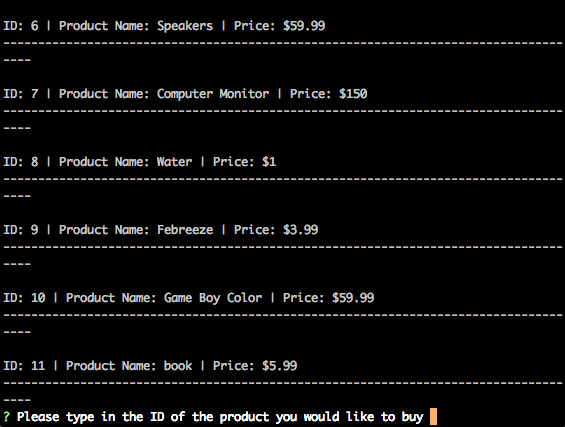
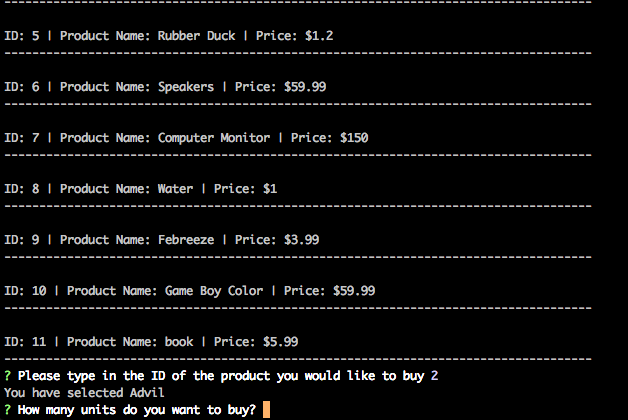
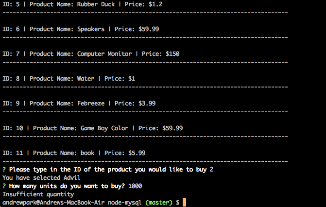
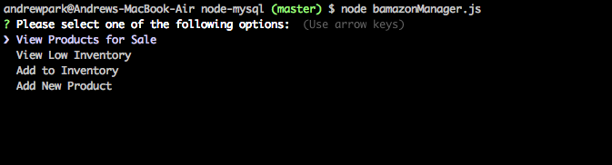
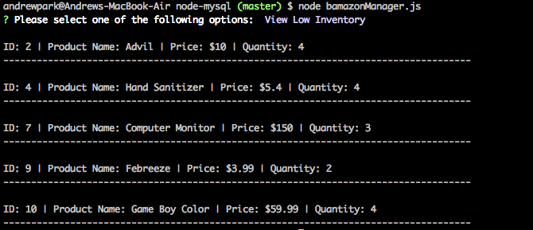
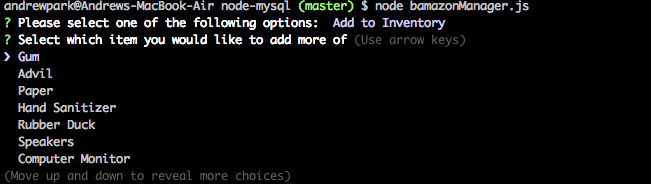
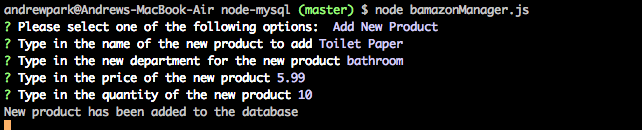

# node-mysql

### Overview

This is a homework that incorporates node with SQL. It uses the same tables with preset values and has different `.js` files that has different functions. 

### Instructions

1.) Use the code in `bamazon.sql` to create a new database with a table. This will create a table called `products` and populate it with 10 different rows. 

2.) Once you have cloned the repo, go to the folder in your terminal and run `npm i` to unpackage the `package.json`. This will install `inquirer` and `mysql` npm package which is required to run the node files. 

3.) To run one of the files, type in `node ***INSERT .JS FILE NAME HERE***`

### bamazonCustomer.js

1.) When you type in `node bamazonCustomer.js` into the terminal, you will be shown the products in the database: 

2.) Typing an ID will show the item you have chosen and ask how much of the product you want. If there is enough quantity of the chosen item, it will update the quantity in the database based on how much you decided to buy:

3.) If there is not enough quantity of an item, it will show "Insufficient Quantity" and end the program. 

### bamazonManager.js

1.) `bamazonManager.js` will give you these 4 options:

2.) The first option will return all the items and their info from the database:

3.) The second option will return all the items with a quantity of 5 or less:

4.) The third option will ask which item in the database you would like to add more of. It will then ask how much more of that item you would like to add:

5.) The last option will ask the user to add an new product with a department name, price, and quantity:

